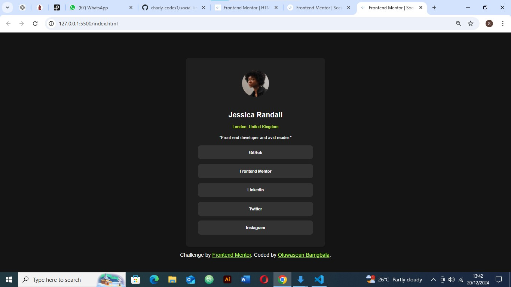

# Frontend Mentor - Social links profile solution

This is a solution to the [Social links profile challenge on Frontend Mentor](https://www.frontendmentor.io/challenges/social-links-profile-UG32l9m6dQ). Frontend Mentor challenges help you improve your coding skills by building realistic projects. 

## Table of contents

- [Overview](#overview)
  - [The challenge](#the-challenge)
  - [Screenshot](#screenshot)
  - [Links](#links)
- [My process](#my-process)
  - [Built with](#built-with)
  - [What I learned](#what-i-learned)
  - [Continued development](#continued-development)
  - [Useful resources](#useful-resources)
- [Author](#author)

## Overview

### The challenge

Users should be able to:

- See hover and focus states for all interactive elements on the page

### Screenshot



### Links

- Solution URL: [Add solution URL here](https://your-solution-url.com)
- Live Site URL: [Add live site URL here](https://your-live-site-url.com)

## My process
My Process for Building the "Social Links Profile" Project
1. Understanding the Goal
I wanted to create a responsive and clean profile card as part of a Frontend Mentor challenge. The idea was to showcase a profile picture, basic user details, and links to social media profiles, all in a visually appealing layout.

2. Setting Things Up
First, I organized my project files. I created folders for assets (like images) and a css folder for styling. Then, I set up the main index.html file and linked a CSS file (style.css) for custom styles. I also added Bootstrap through a CDN to speed up the development process.

3. Building the HTML
I started by structuring the card in HTML:

I used a div with a class of cards to contain everything.
Inside the card, I added an image for the profile picture, a heading for the name, and a subheading for the location.
I included a small bio and a section with buttons for social media links. Lastly, I added an attribution section to credit the challenge source and include my name.
4. Styling with CSS
For styling, I wanted the profile card to look simple and modern:

I used flexbox on the body to center the card vertically and horizontally.
For the card itself, I added rounded corners, a slight shadow, and padding to make it stand out.
I styled the profile image as a circle and adjusted its size to fit nicely within the card.
The buttons were given a neutral gray color with hover effects that change the background and border to green.
5. Making It Responsive
To make sure the design looked good on all screen sizes, I used Bootstrap’s grid system and classes like d-grid, col-6, and gap-2. I also used percentage-based widths and vh units for flexibility. I tested the layout on different devices to ensure everything stayed centered and aligned properly.

6. Adding Interactivity
I styled the buttons to be consistent in size and added hover effects to make them more engaging. The hover effect changes the background and border to green, which adds a nice touch of interactivity.

7. Testing and Adjustments
I tested the project across different browsers (Chrome, Firefox, and Safari) and screen sizes to make sure it looked good everywhere. I adjusted the padding and margins to ensure the card didn’t feel cramped or overly spaced out.

8. Challenges I Faced
One challenge was centering the card in the middle of the viewport while keeping it responsive. I solved this using flexbox and carefully adjusting the padding and margins. Another challenge was balancing Bootstrap classes with my custom CSS, but I figured out where to use each to get the best results.

9. What’s Next?
I plan to replace the placeholder buttons with actual links to social media profiles.
I’d like to add some smooth animations for the button hover effects.
Finally, I might refine the layout further to make it even more polished.

### Built with

- Semantic HTML5 markup
- CSS custom properties
- Flexbox
- CSS Grid
- Mobile-first workflow
- [Bootstrap ](https://reactjs.org/) - cdn library
- [Next.js](https://nextjs.org/) - React framework

### What I learned

What I Learned While Building the "Social Links Profile" Project
1. Understanding the Project Requirements
I started by clearly understanding the project requirements. The goal was to create a visually appealing and responsive profile card with links to social media platforms. This project was inspired by a challenge from Frontend Mentor. The key features I needed to include were:

A profile image with the user’s name, location, and a short bio.
Buttons linking to social media platforms.
A responsive design to ensure the profile card looked good on different screen sizes.
2. Setting Up the Project
I learned the importance of organizing my project from the start. I created a folder structure to store assets (like images), the styles (in css/style.css), and the main index.html file. I also included Bootstrap via CDN for a quick way to implement grid layouts and pre-styled components.

3. Building the HTML Structure
In this step, I focused on creating clean and semantic HTML. I used:

A div container with the class cards for the profile card layout.
An img tag for the profile image and h1 and h5 for the user’s name and location.
A p tag for the user’s bio.
Buttons inside div containers for social media links.
A small attribution section at the bottom to credit the challenge source and myself as the creator.
This taught me the importance of using semantic HTML for accessibility and readability.

4. Applying Styles
I worked on the visual design and learned how to create a clean, modern look. I:

Added a circular profile image with the profile-image class.
Styled the card (cards) with a shadow, rounded corners, and padding.
Used high-contrast colors, like dark gray for the background and white for text, to ensure good readability.
Applied consistent button styles, with a neutral color (#696969), and added hover effects to make the buttons interactive.
This helped me realize how styling choices affect the overall look and feel of the design.

5. Enhancing Responsiveness
I learned the importance of making sure the design works on all screen sizes. I used Bootstrap’s grid system (d-grid, col-6, gap-2, mx-auto) to align buttons and ensure proper spacing. I also styled the body to center the card using flexbox, making sure it stayed centered no matter the screen size. Using flexible units like vh, %, and percentages for padding and dimensions helped the layout remain responsive.

6. Adding Interactivity
I added interactivity by styling buttons with hover effects. This made the buttons change color on hover, providing a more polished user experience. The buttons are placeholders for social media links, which I can update later with actual URLs. This step taught me how small interactive elements can significantly improve the user experience.

7. Testing and Refinement
Testing across multiple screen sizes taught me a lot about responsiveness. I tested the design on mobile, tablet, and desktop sizes, adjusting padding and margins to make sure the card didn’t look cramped or too spaced out. I also checked browser compatibility, testing the design in Chrome, Firefox, and Safari, to make sure it worked across different platforms.

8. Challenges and Solutions
Challenge: Aligning the profile card in the center of the screen was tricky at first.
Solution: I used flexbox to center the card and applied padding to add spacing around it.
Challenge: Using Bootstrap and custom CSS in harmony.
Solution: I used Bootstrap for the grid layout and responsiveness but added custom styles to give the design a unique look and feel.
These challenges taught me how to balance external frameworks with custom design.

9. Next Steps
I need to add real links to the buttons for full functionality.
I also want to incorporate animations for the buttons to create smoother hover effects.
Finally, I plan to optimize the profile card further by reducing unnecessary padding on smaller devices, making it more compact and efficient.


To see how you can add code snippets, see below:

```html
<div class="links">
  <div class="d-grid gap-2 col-6 mx-auto w-100">
    <button class="btn" type="button">FrontendMentor</button>
    <button class="btn" type="button">LinkedIn</button>
  </div>
  <div class="d-grid gap-2 col-6 mx-auto w-100">
    <button class="btn" type="button">Twitter</button>
    <button class="btn" type="button">Instagram</button>
  </div>
</div>

```
```css
.proud-of-this-css {
  @media (min-width: 1024px) {
    .links {
        display: flex;
        flex-wrap: wrap;
        justify-content: center;
        gap: 20px;
    }

    .links button {
        width: auto;
        max-width: 200px;
    }
}

}
```


### Continued development
Here are some areas I would continue focusing on in future projects, based on my experience with this project:

1. Advanced Responsive Design
Focus Area: Refine media queries and breakpoints for better responsiveness, especially for complex layouts.
Why: Although I used Bootstrap and flexbox for responsiveness, I want to focus on more granular control with custom media queries for layouts that don't use standard grid systems. I'd also like to improve how elements scale across a wider range of screen sizes.
2. CSS Grid Layouts
Focus Area: Learn how to use CSS Grid more effectively for complex and two-dimensional layouts.
Why: While Bootstrap provided a quick solution with its grid system, I want to explore CSS Grid for more complex, flexible, and customizable layouts that don’t rely heavily on frameworks.
3. Flexbox Mastery
Focus Area: Refine my use of flexbox to create more dynamic layouts.
Why: Flexbox is extremely useful, but I still want to experiment with more advanced configurations, especially with aligning content in dynamic, multi-column layouts. I want to be able to control spacing, alignment, and layout direction with even more precision.
4. JavaScript Interactivity
Focus Area: Implement dynamic features with JavaScript (e.g., toggling content, validating forms, or adding interactivity to buttons).
Why: While I focused on structure and style in this project, future projects may require more interactive features. I want to improve my ability to add smooth transitions, dynamic content updates, or form validation to create richer user experiences.
5. Custom CSS Animations
Focus Area: Explore CSS animations and transitions for interactive elements like buttons or profile cards.
Why: Adding simple animations can significantly improve the user experience. I want to refine my understanding of CSS keyframes and transitions to create more engaging and polished interactions, especially for hover effects or when elements load onto the page.
6. Web Accessibility
Focus Area: Improve accessibility practices (e.g., using semantic HTML, ARIA roles, and keyboard navigation).
Why: Making web projects accessible to everyone is crucial. I want to ensure that my projects are navigable with screen readers and fully usable by individuals with various abilities.
7. Version Control and Collaboration
Focus Area: Improve my workflow using version control systems (like Git) for better code management and collaboration.
Why: I want to become more comfortable with Git branching, pull requests, and working within teams to develop more efficient workflows for larger projects.
8. Frameworks and Libraries
Focus Area: Gain more experience with JavaScript frameworks like React or Vue.js.
Why: For larger projects that require dynamic content, I want to explore frameworks that can make development more efficient and manageable. React, in particular, is something I plan to learn to improve the interactivity and structure of my web applications.
9. Performance Optimization
Focus Area: Learn more about optimizing performance (e.g., lazy loading, image optimization, minimizing reflows/repaints).
Why: Improving the performance of web pages ensures faster load times and better user experience, especially on mobile devices. I'll focus on optimizing images, reducing unused CSS/JS, and other performance best practices.
By focusing on these areas, I aim to continue building on my strengths and refining techniques that will make my projects even more efficient, accessible, and user-friendly in the future.
## Author
- Github- [charly-codes1](https://github.com/charly-codes1/charly-codes1)
- Frontend Mentor - [@charly-codes1](https://www.frontendmentor.io/profile/@charly-codes1)
